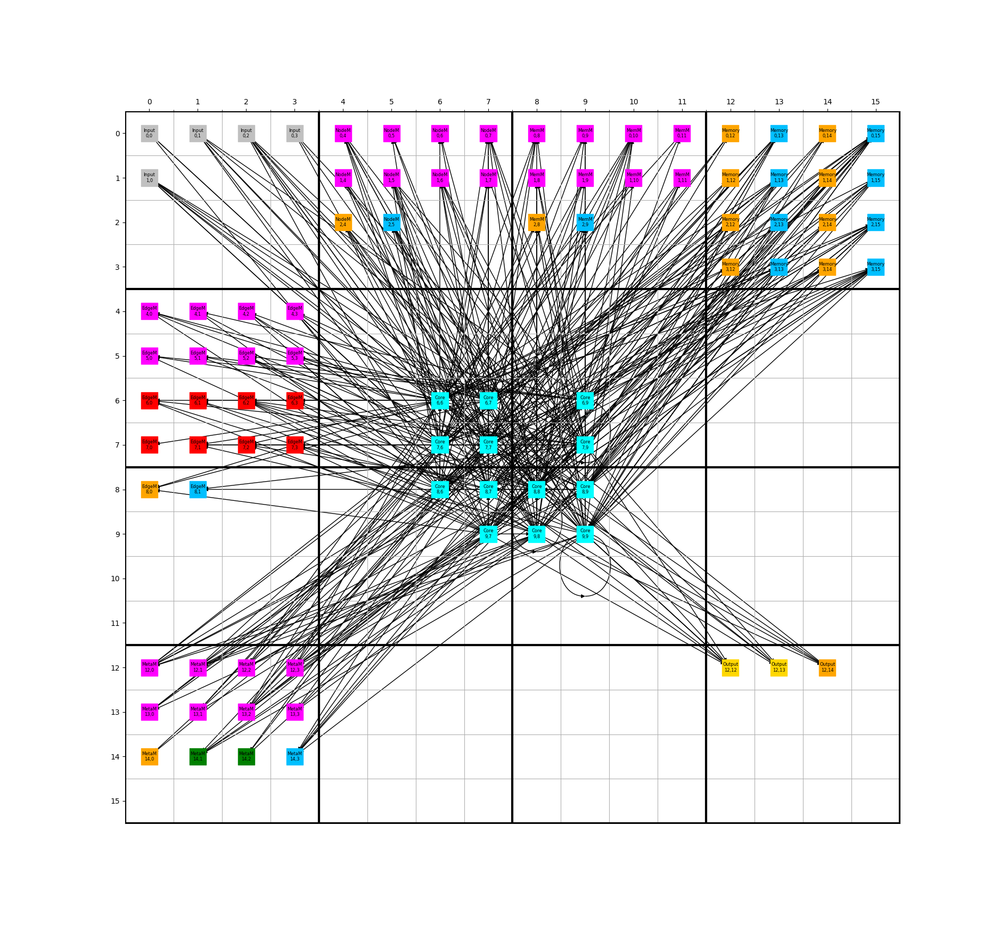

# Hex RNNs - Fully Self Modifying Networks 

Hex is a "shell" which extends the capabilities of normal RNNs to create Hex RNNs - augmented networks which can fully modify both their own structure (nodes/biases and edges/weights) and the Hex shell they integrate with (modules that enable both editing of nodes and edges and the modules themselves).

A Hex RNN could make copies of itself, design an entirely new modified version of itself, or delete components of itself with this shell.

# Old Notes - I'm currently updating this README

~~name of a set of structures for RNNs (Recurrent Neural Networks) to interface with. It allows RNNs inside of it to **fully modify their entire structure.** This means that they can entirely add, edit, and delete their nodes and edges, and since they are integrated with the shell that Hex provides, they can also add, edit, and delete every aspect of the shell that allow them to add, edit, and delete. We call these RNNs **An RNN could make copies of itself or design an entirely new version of itself with this shell.**~~

Built from A1, this Ai model seeks to use the ~~CT~~ RNN base and the NEAT algorithm we familiarized ourselves with in A1 in order to create a new network design, with a "self-mod" capability built into it as another form of output. May come back to the nematode and other connectomes in other models, but this is the next progressive step forward in code, and will allow me to pick pieces from previous ones and move forward without any individual repo getting too bloated with code and references.~~
